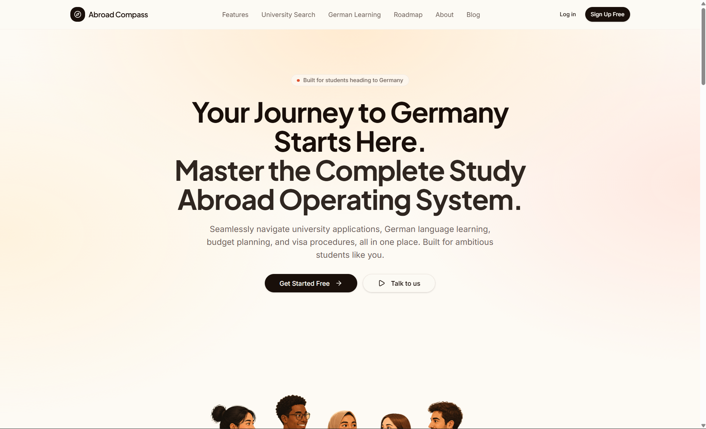
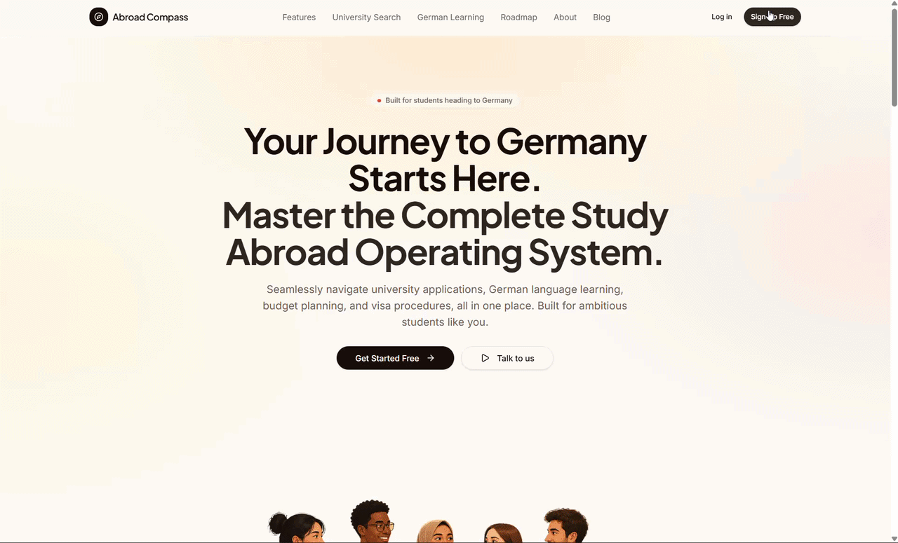
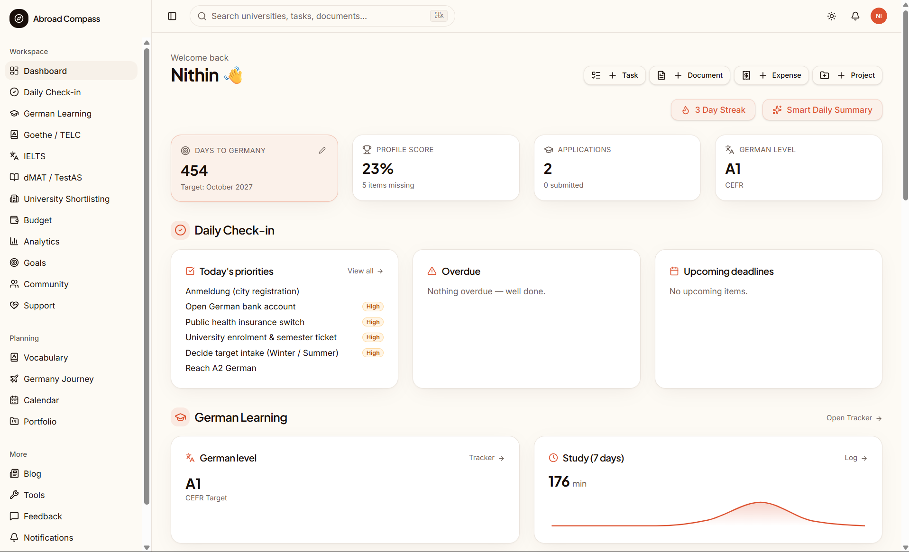
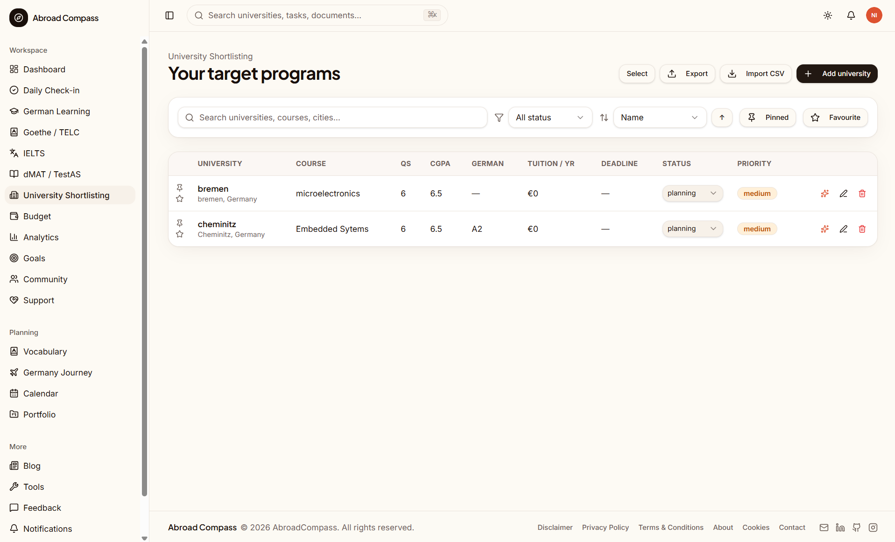
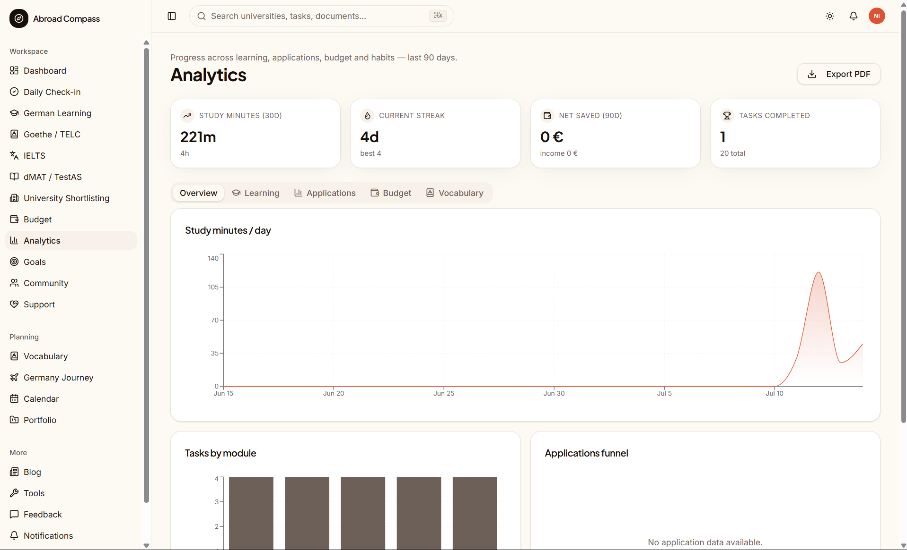
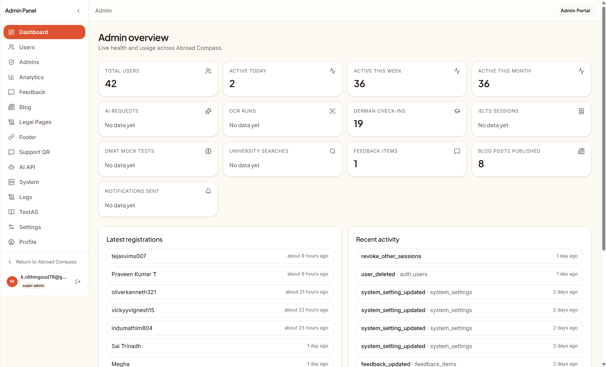
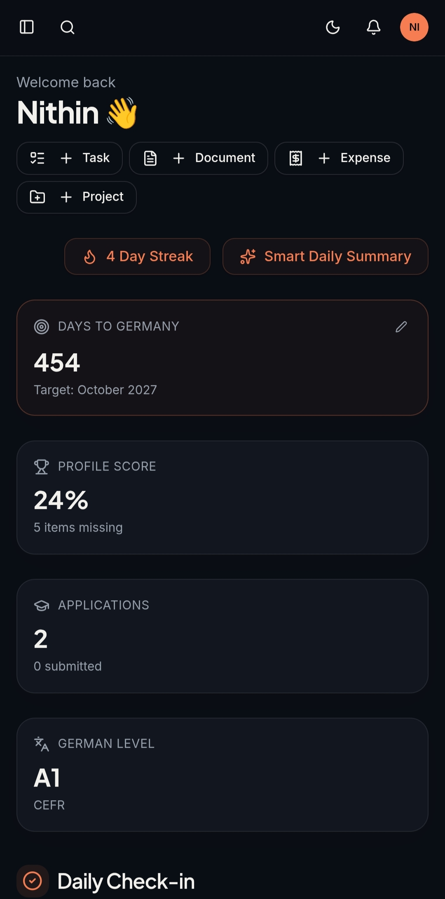

<div align="center">


# Abroad Compass

### The Open Source Germany Master's Application Operating System

One platform to plan, prepare, and track your entire journey to studying in Germany — from roadmap to visa.

<br />

[](https://github.com/nithingoud78/abroad-compass/stargazers)
[](./LICENSE)
[](https://react.dev)
[](https://www.typescriptlang.org)
[](https://supabase.com)
[](https://tanstack.com)
[](https://vercel.com)
[](#)
[](#)

<br />

[**Website**](https://abroad-compass.vercel.app/) · [**Documentation**](https://github.com/nithingoud78/abroad-compass) · [**Report Bug**](https://github.com/nithingoud78/abroad-compass/issues/new?labels=bug) · [**Request Feature**](https://github.com/nithingoud78/abroad-compass/issues/new?labels=enhancement) 
</div>

<br />

<!-- Hero Banner -->
<p align="center">
  
</p>

<br />

<p align="center">
  
</p>

---

## Why Abroad Compass

Applying to a Master's program in Germany is not one task. It's a dozen disconnected ones.

A student preparing for Germany today has to juggle APS certification timelines, TestAS registration, IELTS or TELC scheduling, university-specific deadlines that all differ, a blocked account that has to be opened at the exact right moment, and a visa appointment system that punishes any delay. Each of these lives in a different tab, a different spreadsheet, a different WhatsApp group, a different forum thread.

The result is predictable: missed deadlines, duplicated effort, and thousands of students independently re-solving the same problem with worse information than the person before them.

**Abroad Compass exists to fix that.**

It's not another checklist app. It's a single source of truth — a roadmap engine, a document tracker, a budget planner, an AI mentor, and a community, built specifically around how the German Master's application process actually works. Everything a student needs to go from "I want to study in Germany" to "I have my visa" lives in one place.

<br />

## Key Features

<table>
<tr>
<td width="33%" valign="top">

### 🧭 Germany Roadmap
A personalized, stage-by-stage timeline from research to visa, adapted to your intake and program type.

</td>
<td width="33%" valign="top">

### 🎓 University Planner
Shortlist, compare, and track application status across every university you're applying to.

</td>
<td width="33%" valign="top">

### 📜 APS Tracker
Step-by-step guidance through APS certificate preparation and document verification.

</td>
</tr>
<tr>
<td width="33%" valign="top">

### 🧠 TestAS Prep
Track registration, practice progress, and score targets for the TestAS exam.

</td>
<td width="33%" valign="top">

### 🗣️ IELTS & Goethe/TELC
Manage language exam prep, bookings, and score requirements per university.

</td>
<td width="33%" valign="top">

### 💰 Budget Planner
Model tuition, living costs, and blocked account requirements against your real finances.

</td>
</tr>
<tr>
<td width="33%" valign="top">

### 🏦 Blocked Account
Guided setup flow for opening and funding a German blocked account correctly, the first time.

</td>
<td width="33%" valign="top">

### 🛂 Visa Preparation
A document-by-document visa checklist tailored to your consulate and program.

</td>
<td width="33%" valign="top">

### 🤖 AI Mentor
An AI guide trained on the Germany application process, available whenever you're stuck.

</td>
</tr>
<tr>
<td width="33%" valign="top">

### 📊 Analytics
Visual insight into your progress, deadlines at risk, and where you're falling behind.

</td>
<td width="33%" valign="top">

### 👥 Community
Connect with other applicants, ask questions, and share timelines.

</td>
<td width="33%" valign="top">

### 🗂️ Portfolio
A single place to store and organize every document your applications require.

</td>
</tr>
<tr>
<td width="33%" valign="top">

### 🛠️ Admin CMS
A full internal dashboard for managing users, content, and platform data.

</td>
<td width="33%" valign="top">

### ✍️ Blog
In-depth guides on APS, visas, universities, and life in Germany.

</td>
<td width="33%" valign="top">

### 🔔 Notifications
Deadline reminders that reach you before it's too late, not after.

</td>
</tr>
<tr>
<td width="33%" valign="top">

### 📅 Calendar
All your exam dates, appointments, and deadlines in one synced view.

</td>
<td width="33%" valign="top">

### ✅ Daily Check-in
A lightweight daily habit loop that keeps your application moving forward.

</td>
<td width="33%" valign="top">

&nbsp;

</td>
</tr>
</table>

<br />

## Screenshots

<p align="center">
  <br />
  <sub>Dashboard — your entire journey at a glance</sub>
</p>

<p align="center">
  <br />
  <sub>University Planner — shortlist and track applications</sub>
</p>

<p align="center">
  <br />
  <sub>Analytics — progress and risk at a glance</sub>
</p>

<p align="center">
  <br />
  <sub>Admin CMS — manage the platform end to end</sub>
</p>

<p align="center">
  <br />
  <sub>Fully responsive, mobile-first design</sub>
</p>

<br />

## Architecture

Abroad Compass is built as a modern, server-first full-stack application.

```
┌──────────────────────────────────────────────────────────┐
│                        Client (Browser)                    │
│         React 19 · TanStack Router · Tailwind v4            │
└───────────────────────────┬──────────────────────────────┘
                              │
┌───────────────────────────▼──────────────────────────────┐
│                    TanStack Start (SSR)                    │
│        Server Functions · API Routes · Middleware           │
└───────────────────────────┬──────────────────────────────┘
                              │
        ┌────────────────────┼────────────────────┐
        │                    │                    │
┌───────▼───────┐  ┌─────────▼────────┐  ┌────────▼────────┐
│   Supabase     │  │  AI Providers     │  │  Object Storage  │
│  Auth · Postgres│  │ Gemini · OpenRouter│ │  Supabase Storage │
│  Row Level Sec. │  │  via Vercel AI SDK │ │  Docs & Images    │
└────────────────┘  └───────────────────┘  └──────────────────┘
```

- **Frontend** — React 19 with TanStack Router for type-safe, file-based routing.
- **Backend** — TanStack Start server functions handle mutations and data loading with full type safety end to end.
- **Authentication** — Supabase Auth (email, OAuth) issuing JWTs consumed by both client and server.
- **Database** — PostgreSQL on Supabase, with Row Level Security enforcing per-user data isolation.
- **Storage** — Supabase Storage for documents, portfolios, and uploaded assets.
- **AI** — Vercel AI SDK routing between Google Gemini and OpenRouter for the AI Mentor.
- **Deployment** — Vercel for the application, Supabase for the managed backend.

<br />

## Tech Stack

| Layer | Technology |
|---|---|
| UI Library | React 19 |
| Framework | TanStack Start |
| Routing | TanStack Router |
| Data Fetching | TanStack Query |
| Language | TypeScript (strict) |
| Styling | Tailwind CSS v4 |
| Components | Shadcn/UI + Radix Primitives |
| Database | Supabase (PostgreSQL) |
| Auth | Supabase Auth |
| Charts | Recharts |
| AI SDK | Vercel AI SDK |
| AI Models | Google Gemini · OpenRouter |
| Forms | React Hook Form |
| Validation | Zod |
| Hosting | Vercel |

<br />

## Folder Structure

```
abroad-compass/
├── src/
│   ├── routes/            # File-based routes (TanStack Router)
│   ├── components/        # Shared UI components (Shadcn-based)
│   ├── features/          # Feature modules (roadmap, visa, budget, etc.)
│   ├── server/             # Server functions & API handlers
│   ├── lib/                # Utilities, clients, helpers
│   ├── hooks/               # Shared React hooks
│   ├── types/                # Shared TypeScript types
│   └── styles/                # Tailwind config & global styles
├── supabase/
│   ├── migrations/         # SQL migrations
│   └── policies/           # Row Level Security policies
├── docs/
│   └── images/              # README & documentation assets
├── public/                  # Static assets
├── .env.example
├── package.json
└── README.md
```

<br />

## Getting Started

### Prerequisites

- Node.js ≥ 20
- pnpm ≥ 9
- A Supabase project

### Installation

```bash
# 1. Clone the repository
git clone https://github.com/nithingoud78/abroad-compass.git
cd abroadcompass

# 2. Install dependencies
pnpm install

# 3. Configure environment variables
cp .env.example .env.local
# then fill in .env.local — see the table below

# 4. Set up Supabase
pnpm supabase login
pnpm supabase link --project-ref <your-project-ref>
pnpm supabase db push

# 5. Run the development server
pnpm dev
```

The app will be available at `http://localhost:3000`.

### Production Build

```bash
pnpm build
pnpm start
```

<br />

## Environment Variables

| Variable | Description | Scope |
|---|---|---|
| `VITE_SUPABASE_URL` | Your Supabase project URL | Public |
| `VITE_SUPABASE_ANON_KEY` | Supabase anon/public key | Public |
| `SUPABASE_SERVICE_ROLE_KEY` | Supabase service role key for privileged server operations | Secret |
| `GOOGLE_GENERATIVE_AI_API_KEY` | API key for Gemini, used by the AI Mentor | Secret |
| `OPENROUTER_API_KEY` | API key for OpenRouter model fallback | Secret |
| `VITE_SUPABASE_URL` | Public base URL of the deployed app | Public |
| `RESEND_API_KEY` | API key for transactional email notifications | Secret |

> **Note**
> Never commit `.env.local`. Secret-scoped variables must only be set in your server / hosting environment, never exposed to the client bundle.

<br />

## Deployment

<details>
<summary><strong>Deploy to Vercel</strong></summary>

<br />

1. Push your fork to GitHub.
2. Import the repository into [Vercel](https://vercel.com/new).
3. Add all environment variables from the table above in the Vercel project settings.
4. Deploy — Vercel will build and host the app automatically on every push to `main`.

</details>

<details>
<summary><strong>Set up Supabase</strong></summary>

<br />

1. Create a new project at [supabase.com](https://supabase.com).
2. Run `pnpm supabase db push` to apply migrations.
3. Enable Row Level Security policies from `supabase/policies/`.
4. Copy your project URL and keys into your environment variables.

</details>

<details>
<summary><strong>Custom Domain</strong></summary>

<br />

Attach your domain in the Vercel dashboard under **Project → Settings → Domains**, then update `VITE_SUPABASE_URL` accordingly.

</details>

<br />

## Security

Abroad Compass takes data protection seriously, since it handles sensitive documents and personal information.

- **Supabase Auth** — Secure, standards-based authentication with email and OAuth providers.
- **JWT** — Every request is authenticated via short-lived, signed JSON Web Tokens.
- **Row Level Security** — Every table is protected by Postgres RLS policies, ensuring users can only ever access their own data.
- **Admin Roles** — A dedicated role-based access system separates regular users from admin/CMS privileges.
- **Policies** — All read/write access is enforced at the database layer, not just the application layer.
- **Protected Routes** — Sensitive routes are guarded both on the client and via server-side session validation.

Found a vulnerability? Please see [`SECURITY.md`](./SECURITY.md) for responsible disclosure instructions rather than opening a public issue.

<br />

## Roadmap

- [x] Germany Roadmap Engine
- [x] University Shortlisting & Tracker
- [x] APS / TestAS / IELTS / Goethe Tracking
- [x] Budget Planner
- [x] Blocked Account Guide
- [x] AI Mentor
- [x] Admin CMS
- [ ] Native Mobile App (iOS / Android)
- [ ] Scholarship Finder
- [ ] University API Integrations
- [ ] Document OCR
- [ ] AI SOP Review
- [ ] Visa Appointment Timeline Tracker
- [ ] Blocked Account Balance Tracker
- [ ] Calendar Sync (Google / Outlook)
- [ ] Push Notifications
- [ ] Community Marketplace
- [ ] Community Events
- [ ] Dark Mode Refinements
- [ ] Offline Mode

See the full [project board](https://github.com/nithingoud78/abroad-compass) for progress and planning.

<br />

## Contributing

Abroad Compass is built in the open, and contributions of every size are welcome — code, documentation, design, or ideas.

> **Every German applicant who benefits from this project started by someone opening a pull request.**

1. Fork the repository
2. Create a feature branch — `git checkout -b feature/your-feature`
3. Commit your changes — `git commit -m "feat: add your feature"`
4. Push to your branch — `git push origin feature/your-feature`
5. Open a Pull Request

Before contributing, please read [`CONTRIBUTING.md`](./CONTRIBUTING.md) and our [`CODE_OF_CONDUCT.md`](./CODE_OF_CONDUCT.md).

- 🐛 Found a bug? [Open an issue](https://github.com/nithingoud78/abroad-compass/issues/new?labels=bug)
- 💡 Have an idea? [Request a feature](https://github.com/nithingoud78/abroad-compass/issues/new?labels=enhancement)
- 🔧 Ready to code? Check issues labeled [`good first issue`](https://github.com/nithingoud78/abroad-compass/labels/good%20first%20issue)

<br />

## License

Distributed under the **MIT License**. See [`LICENSE`](./LICENSE) for more information.

<br />

## Author

<div align="center">

**Built and maintained by K Nithin Kumar Goud**

[](https://github.com/nithingoud78)
[](https://linkedin.com/in/nithin-goud78)
[](https://yourwebsite.com)
[](mailto:k.nithingoud78@gmail.com)

</div>

<br />

## Acknowledgements

Abroad Compass is made possible by the open source ecosystem it's built on:

- [Supabase](https://supabase.com) — backend, auth, and database infrastructure
- [TanStack](https://tanstack.com) — routing, data fetching, and application framework
- [Vercel](https://vercel.com) — hosting and deployment
- [Shadcn/UI](https://ui.shadcn.com) — component foundation
- The **Open Source Community**, for the tools that made this possible
- The **Germany Student Community**, for the insight that shaped every feature

<br />

<div align="center">

**If Abroad Compass helped your application, consider giving it a ⭐**

Made with care for every student navigating the road to Germany.

</div>